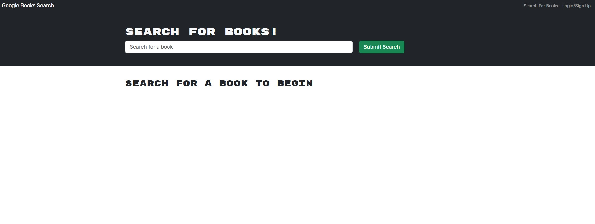

# Book Search Engine

## Description

The Book Search Engine is a full-stack MERN application that allows users to search for books via the Google Books API, view book details, and save books to review or purchase later. This project demonstrates the use of GraphQL with Apollo Server and Apollo Client within a React application, showcasing seamless data fetching and state management practices.

## Features

- **Search for Books**: Users can search for books using the Google Books API.
- **Save Books**: Authenticated users can save books to their account for later review or purchase.
- **View Saved Books**: Users can view a list of their saved books.
- **Authentication**: Users can sign up and log in to access personalized features.

## Technologies Used

- MongoDB
- Express.js
- React.js
- Node.js
- GraphQL
- Apollo Server
- Apollo Client
- JSON Web Token (JWT) for authentication

## Usage

After starting the app, navigate to http://localhost:3000 in your browser. You can search for books using the search bar. To save books and view your saved books, you will need to sign up or log in.

### Prerequisites

- [Node.js](https://nodejs.org/en/download/)
- [MongoDB](https://www.mongodb.com/try/download/community)

## License

This project is licensed under the MIT License - see the [LICENSE](LICENSE) file for details.

## Deployment

This application is deployed on Render.[Click here](https://book-search-engine-v9bj.onrender.com/) to view the live project.

